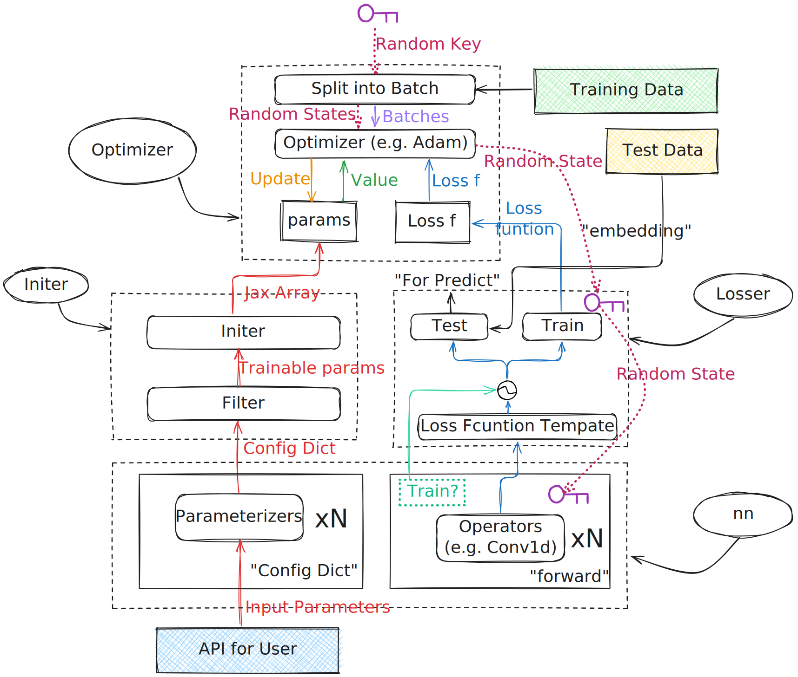

# ✨ Mini-torch

  

Overview of Framework

## # Implemented Components

- nn
  - Model (Base Class for Nerual Networks, like nn.Module in torch)
  - Conv
    - Conv1d, Conv2d, Conv3d
    - MaxPooling1d, MaxPooling2d, MaxPooling3d
    - BatchNorm <mark>TODO</mark>
  - RnnCell
    - Basic rnn kernel
    - LSTM kernel
    - GRU kernel
    - BiLSTM kernel
    - BiGRU kernel
    - Layer Norm <mark>TODO</mark>
  - FC
    - Dropout
    - Linear
- Optimizer
  - Algorithms
    - Raw GD
    - Momentum
    - Nesterov(NAG)
    - AdaGrad
    - RMSProp
    - AdaDelta
    - Adam[[1](#reference)]
  - Machanisms
    - Lr Decay. <mark>TODO</mark>
    - Weight Decay. <mark>TODO</mark>
    - Freeze. <mark>TODO</mark>
- Utils
  - sigmoid
  - one hot
  - softmax
  - cross_entropy_loss
  - mean_square_error
  - l1_regularization
  - l2_regularization

## # NoteBook Docs

Some small tests for debug during the development of this project:

- How to Use Mini-torch? <ins>_A brief e.g. Doc_</ins> <mark>TODO</mark>
- How to Use Jax Gradient, <ins>_Ideas about how I manage parameters in this Framework_</ins>.
- Some Jax Tips, <ins>_About How to Use Jax Builtins & JIT to Optimize Loops & Matrix Operations._</ins>
- Kaiming Initialization[[2](#reference)] used in MLP & Conv, <ins>_With math derivation._</ins>
- Difference between Conv2d Operation by python loop and by <ins>**Jax.lax**</ins>.
- Dropout mechanism impl, <ins>_About Seed in Jax_.</ins>
- Runge-Kuta solver for Neural ODE.

# Reference
[[1](https://arxiv.org/abs/1412.6980?spm=5176.28103460.0.0.40f7451eXLzPoY&file=1412.6980)] Kingma, D. P., & Ba, J. (2014). Adam: A Method for Stochastic Optimization. Proceedings of the International Conference on Learning Representations (ICLR).   
[[2](https://arxiv.org/abs/1502.01852)] He, K., Zhang, X., Ren, S., & Sun, J. (2015). Delving Deep into Rectifiers: Surpassing Human-Level Performance on ImageNet Classification. In Proceedings of the IEEE International Conference on Computer Vision (ICCV) (pp. 1026–1034).   
