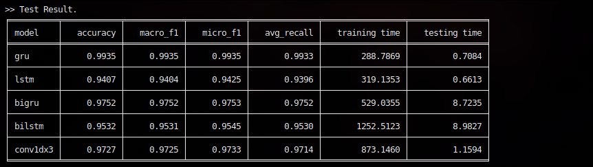

# Test case: UCI HAR.  

This is a classic dataset of Human Activity Recognition. The data is downloaded from [here](https://archive.ics.uci.edu/ml/datasets/Human+Activity+Recognition+Using+Smartphones). Here are the implemented models & result of them. 

### # Models
- GRU   
- LSTM  
- BiGRU   
- BiLSTM  
- Conv1d, 3 layers  

### # Results

